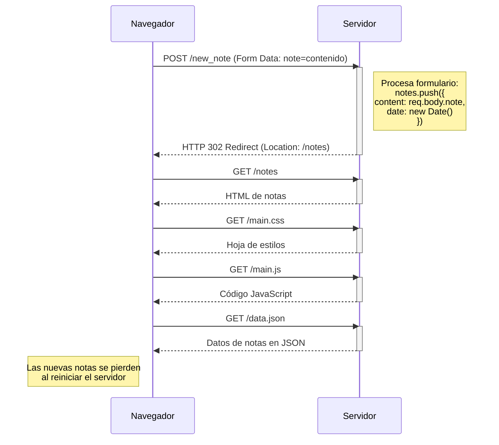

```mermaid
%% Ejemplo de diagrama de secuencia del flujo POST y redirección
sequenceDiagram
participant Navegador
participant Servidor

    Navegador->>Servidor: POST /new_note (Form Data: note=contenido)
    activate Servidor
        Note right of Servidor: Procesa formulario:<br/>notes.push({<br/>  content: req.body.note,<br/>  date: new Date()<br/>})
        Servidor-->>Navegador: HTTP 302 Redirect (Location: /notes)
    deactivate Servidor

    Navegador->>Servidor: GET /notes
    activate Servidor
        Servidor-->>Navegador: HTML de notas
    deactivate Servidor

    Navegador->>Servidor: GET /main.css
    activate Servidor
        Servidor-->>Navegador: Hoja de estilos
    deactivate Servidor

    Navegador->>Servidor: GET /main.js
    activate Servidor
        Servidor-->>Navegador: Código JavaScript
    deactivate Servidor

    Navegador->>Servidor: GET /data.json
    activate Servidor
        Servidor-->>Navegador: Datos de notas en JSON
    deactivate Servidor

    Note left of Navegador: Las nuevas notas se pierden<br/>al reiniciar el servidor
```
