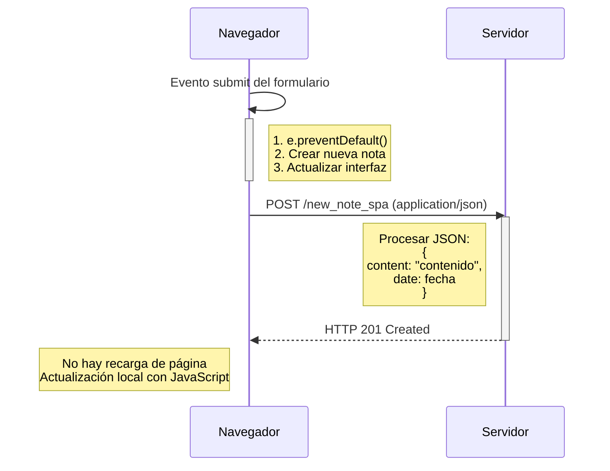

```mermaid
%% Diagrama de flujo SPA
sequenceDiagram
participant Navegador
participant Servidor

    Navegador->>Navegador: Evento submit del formulario
    activate Navegador
        Note right of Navegador: 1. e.preventDefault()<br/>2. Crear nueva nota<br/>3. Actualizar interfaz
    deactivate Navegador

    Navegador->>Servidor: POST /new_note_spa (application/json)
    activate Servidor
        Note left of Servidor: Procesar JSON:<br/>{<br/>  content: "contenido",<br/>  date: fecha<br/>}
        Servidor-->>Navegador: HTTP 201 Created
    deactivate Servidor

    Note left of Navegador: No hay recarga de página<br/>Actualización local con JavaScript

```
